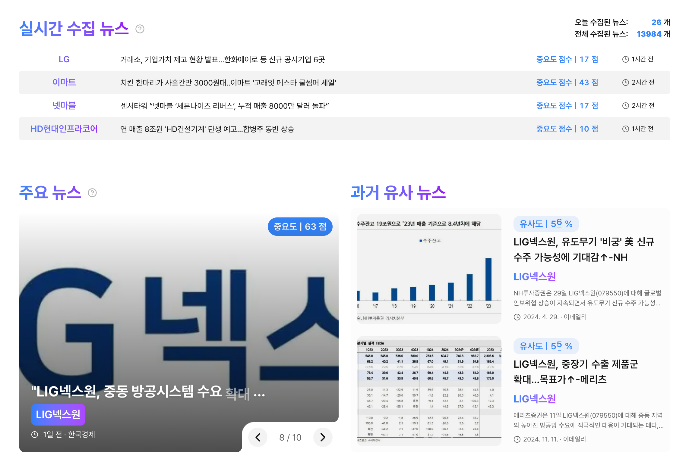

# 주식 투자 판단을 위한, 과거 유사 뉴스 제공 서비스

[서비스 링크 - https://news-toss.vercel.app](https://news-toss.vercel.app/)


<table>
  <tr>
    <td align="center">
      <br>
      <a href="https://github.com/Joo-an">이주안</a><br>
      과거 유사 뉴스 챗봇<br>
      맞춤 뉴스 추천 모델링
    </td>
    <td align="center">
      <br>
      <a href="https://github.com/yoo754">정혜진</a><br>
      주요 뉴스 선별 모델링<br>
      맞춤 뉴스 추천 모델링
    </td>
    <td align="center">
      <br>
      <a href="https://github.com/choikwangil95">최광일</a><br>
      과거 유사 뉴스 선별 모델링<br>
      모델 서빙 인프라 구축
    </td>
    <td align="center">
      <br>
      <a href="https://github.com/yeaaaun">한예은</a><br>
      뉴스 관련 주식 종목 매칭<br>
      과거 유사 뉴스 선별 모델링
    </td>
  </tr>
</table>

## 1 프로젝트 개요

주식 투자자들이 특정 사건 발생으로 인한 주식 투자 의사결정을 돕기 위해,
<br>
과거 유사 사건 뉴스를 제공하여 주식 투자 판단에 도움을 주고자 합니다.

### 1 실시간 주요 뉴스와 과거 유사 뉴스 제공  



### 2 과거 유사 뉴스 상세 분석  


### 3 과거 유사 뉴스 챗봇  


### 4 개인 맞춤 뉴스 추천  


## 2 프로젝트 구조
### 폴더구조
```markdown
📁 src
 ㄴ 📁 .dvc                     # DVC 설정
 ㄴ 📁 .github                  # github actions
 ㄴ 📁 airflow                  # airflow
 ㄴ 📁 automation               # 데이터 수집 자동화
 ㄴ 📁 db                       # DVC 파일
 ㄴ 📁 eda                      # 데이터 분석
 ㄴ 📁 fastapi                  # DB 조회 서버
 ㄴ 📁 modelapi                 # 모델 추론 서버
 ㄴ 📁 prometheus               # 모니터링
📄 requirements.txt
📄 docker-compose.yaml
```

### 시스템 아키텍쳐


- 데이터 관리: DVC, S3
- 데이터 수집: Python schedule
- 데이터 저장: PostgreSQL
- 모델 서빙: FastAPI
- 모델 모니터링: Prometheus, Grafana
- CI/CD: Github Actions

## 3 개발환경 구성
### 기술 스택
- **언어**: Python 3.11
- **패키지 관리**: Miniconda

### 프로젝트 설정

```bash
# 1 프로젝트 폴더 생성 및 저장소 초기화
mkdir <folder_name>
cd <folder_name>
git init

# 2 저장소 복제 및 동기화
git remote add origin https://github.com/choikwangil95/HKToss-MLOps-Proejct-Final.git
git pull origin main

# 3 가상환경 설정
conda create -n <env_name> python=3.11 pip
conda activate <env_name>

# 4 Jupyter Notebook 커널 설정
conda install ipykernel --update-deps --force-reinstall

# 5 requirements 설치
pip install -r requirements.txt
```

## 4 개발 프로세스


### 브랜치 관리
- `main` : 운영 환경
- `develop` : 개발 환경
- `feature` : 기능 개발

### 작업 흐름

```bash
# 1 최신 develop 브랜치 동기화
git checkout develop
git pull origin develop

# 2 새로운 기능 브랜치 생성
git checkout -b <feature_branch>

# 3 작업 후 변경 사항 저장
git add .
git commit -m "커밋 메시지"

# 4 develop 브랜치 병합 (충돌 확인 필수)
git checkout develop
git pull origin develop
git merge <feature_branch>

# 5 원격 저장소 반영
git push origin develop
```
